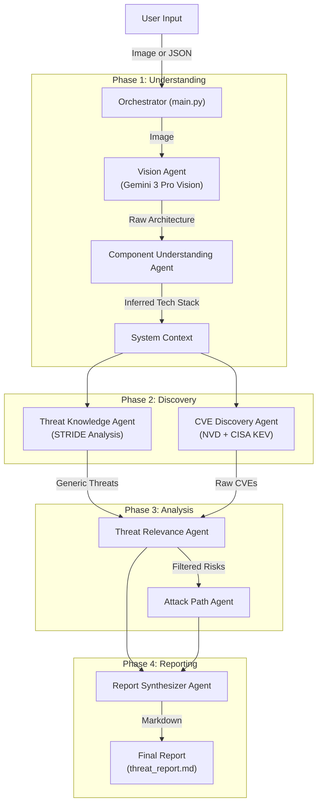

# 🛡️ Sentinel: AI-Powered Multi-Agent Threat Modeling System


> **Problem:** Modern software architectures are complex, and manual threat modeling is slow, inconsistent, and often misses critical vulnerabilities buried in dependency chains.
>
> **Why Agents:** Static tools miss context. Humans miss scale. AI Agents can "reason" about architecture like a security architect but at machine speed.
>
> **Solution:** Sentinel. A multi-agent system that sees your diagram, understands your stack, finds specific CVEs, and simulates attacks to prove the risk.
>
> **Impact:** Shift security left. Catch design flaws before code is written. Reduce triage time from days to minutes.

A fully automated, AI-driven pipeline that converts architecture diagrams or JSON into complete threat models, including STRIDE threats, CWE mapping, CVE discovery, attack-path simulations, and NIST 800-53 aligned mitigations.

Powered by **Google Gemini 3 Pro** and **Gemini 3 Pro Vision**.

---

## 🚀 Key Features

*   **Multimodal Analysis**: Upload a raw architecture diagram (PNG/JPG) **or a structured JSON definition**, and the system automatically extracts components, data flows, and trust boundaries.
*   **Intelligent Inference**: The **Component Understanding Agent** infers specific technologies from generic labels (e.g., inferring "PostgreSQL" from "Database" if "Django" is present).
*   **Real-Time Threat Intel**: Queries the **NVD (National Vulnerability Database)** and **CISA KEV (Known Exploited Vulnerabilities)** catalog to find active CVEs for your specific stack.
*   **Context-Aware Filtering**: The **Threat Relevance Agent** uses LLM reasoning to filter out false positives, ensuring you only see risks that actually apply to your architecture.
*   **Attack Path Simulation**: The **Attack Path Agent** "thinks" like a red teamer, chaining vulnerabilities together to demonstrate realistic kill chains.
*   **Professional Reporting**: Generates a comprehensive, "Senior Security Architect" grade Markdown report (`threat_report.md`) with executive summaries, mitigation strategies, and compliance mappings (NIST 800-53).

---

## ⚡ Features Implemented (Google AI SDK & Vertex AI)

This project leverages the full capabilities of the **Google AI SDK (ADK)** and **Vertex AI** to build a robust, production-grade agentic system:

*   **Multi-Agent Orchestration**: Implements a sequential pipeline where specialized agents (Vision, Knowledge, Relevance) pass structured context (Pydantic models) to build a cumulative understanding of the system.
*   **Tools & Function Calling**: Agents are equipped with custom tools (`search_vulnerabilities`, `process_architecture_diagram`) to ground their reasoning in real-world data from NVD and CISA.
*   **Vertex AI Reasoning Engine**: The entire agent pipeline is deployed as a **Reasoning Engine** on Vertex AI, enabling it to run as a scalable, long-running cloud operation.
*   **Context & Memory**: Agents maintain architectural context across steps, ensuring that a vulnerability found in Phase 2 is correctly referenced in the Attack Path simulation in Phase 3.
*   **Observability & Reliability**: Uses `tenacity` for exponential backoff/retry logic and structured logging to ensure resilience against API rate limits and transient failures.

---

## 🏗️ System Architecture

The system operates as a pipeline of specialized agents, each handling a specific stage of the threat modeling process.



---

## 🤖 Agent Breakdown

| Agent | Model | Responsibility |
| :--- | :--- | :--- |
| **Vision Agent** | `gemini-3-pro-image-preview` | Analyzes diagram images to extract structured architecture data (components, flows, boundaries). |
| **Component Understanding Agent** | `gemini-3-pro-preview` | Infers specific products from generic labels (e.g., "Load Balancer" → "Nginx") using stack context. |
| **Threat Knowledge Agent** | `gemini-3-pro-preview` | Performs deep STRIDE analysis. **New:** Includes a **Self-Correction Loop** where a secondary "Validator Agent" reviews findings to ensure CWE mappings are accurate. |
| **CVE Discovery Agent** | *Tool-based* | Queries NVD and CISA APIs to find known vulnerabilities for the inferred technologies. |
| **Threat Relevance Agent** | `gemini-3-pro-preview` | Filters false positives. **New:** Performs **Dynamic Risk Promotion**, automatically elevating critical CVEs (like RCEs) into top-level architectural threats. |
| **Attack Path Agent** | `gemini-3-pro-preview` | Simulates multi-step attack scenarios (e.g., "External User" → "Web Shell" → "DB Dump"). |
| **Report Synthesizer Agent** | `gemini-3-pro-preview` | Compiles all findings into a structured, narrative report with prioritized mitigations. |

---

## 🛠️ Installation

### Prerequisites
*   Python 3.10 or higher
*   A Google Cloud Project with Vertex AI or Gemini API access.
*   (Optional) NVD API Key for higher rate limits.

### Setup

1.  **Clone the repository:**
    ```bash
    git clone https://github.com/Manish-Mahesh/threat-modeling-agent.git
    cd threat-modeling-agent
    ```

2.  **Create a virtual environment:**
    ```bash
    python -m venv .venv
    source .venv/bin/activate  # On Windows: .venv\Scripts\activate
    ```

3.  **Install dependencies:**
    ```bash
    pip install -r requirements.txt
    ```

4.  **Configure Environment Variables:**
    Create a `.env` file in the root directory:
    ```env
    GEMINI_API_KEY=your_google_gemini_api_key
    NVD_API_KEY=your_nvd_api_key  # Optional but recommended
    ```

---

## ☁️ Cloud Deployment (Vertex AI)

The system is designed to be deployed as a **Vertex AI Reasoning Engine**, allowing it to be consumed as a scalable API service.

### Deployment

1.  **Configure Google Cloud Project:**
    Ensure you have the Google Cloud SDK installed and authenticated.
    ```bash
    gcloud auth application-default login
    gcloud config set project YOUR_PROJECT_ID
    ```

2.  **Set Deployment Variables:**
    ```powershell
    $env:GOOGLE_CLOUD_PROJECT="your-project-id"
    $env:GCS_STAGING_BUCKET="gs://your-staging-bucket"
    ```

3.  **Deploy the Agent:**
    Run the deployment script to package and upload the agent to Vertex AI.
    ```bash
    python deploy_agent.py
    ```

### Remote Usage

Once deployed, you can interact with the agent remotely using the Python SDK:

```python
from vertexai.preview import reasoning_engines

# Initialize the remote agent
agent_id = "projects/YOUR_PROJECT/locations/us-central1/reasoningEngines/YOUR_AGENT_ID"
remote_agent = reasoning_engines.ReasoningEngine(agent_id)

# Query the agent
response = remote_agent.query(input={
    "project_name": "My Cloud App",
    "components": [...]
})

print(response)
```

---

## 💻 Usage

### 1. Analyze an Architecture Diagram
The most common way to use the tool is to provide an image of your system architecture.

```bash
python main.py --image data/my_architecture.png
```

### 2. Analyze from JSON Input
If you already have the architecture defined in JSON format (or want to re-run analysis on previous output):

```bash
python main.py --input data/architecture_data.json
```

### Output
The tool will generate a file named **`threat_report.md`** in the root directory. This file contains the complete threat model.

---

## 🧪 Sample Execution & Verification

A sample architecture diagram (`data/test_arch4.png`) and a pre-generated report (`threat_report.md`) are included in the repository for verification purposes.

To verify the system functionality, run the following command:

```bash
python main.py --image data/test_arch4.png
```

**Note:** Running this command will analyze the sample image and **overwrite** the existing `threat_report.md` with a newly generated threat model based on the current analysis.

---

## ⚙️ Robustness & Optimizations

To ensure production-grade reliability and performance, the system includes several advanced engineering features:

*   **Resilient LLM Integration**: Implements **Exponential Backoff & Retry** logic (via `tenacity`) to gracefully handle API rate limits (`429`) and transient service errors (`503`).
*   **Smart Batching**: The **Component Understanding Agent** batches inference requests into a single LLM call, significantly reducing latency and API token usage compared to sequential processing.
*   **Graceful Degradation**: If specific inference steps fail (e.g., NVD API downtime or LLM overload), the pipeline falls back to safe defaults or generic categories rather than crashing the entire workflow.
*   **Input Sanitization**: Automatically cleans and validates search terms before querying external APIs (NVD/CISA) to prevent malformed requests.
*   **Structured Output Validation**: All AI agents use **Pydantic** models to enforce strict JSON schemas, ensuring that downstream components always receive valid, well-typed data.
*   **Caching**: Implements `lru_cache` for static threat intelligence feeds (like CISA KEV) to minimize redundant network traffic.

---

## 🎯 Accuracy & Hallucination Prevention

To ensure the threat model is grounded in reality and free from AI hallucinations, the system employs several strict verification layers:

*   **No Generic CVE Lookups**: The system **never** queries the National Vulnerability Database (NVD) for generic terms like "Database", "Server", or "Cloud". It only searches for specific, inferred technologies (e.g., "Redis", "Nginx", "PostgreSQL") to prevent flooding the report with irrelevant vulnerabilities.
*   **Confidence-Based Inference**: The **Component Understanding Agent** only assigns a specific technology to a component if it has high confidence (>60%) based on the surrounding architecture context. Otherwise, it remains a generic component with standard architectural threats but no specific CVEs.
*   **Contextual Relevance Filtering**: Even if a CVE is found, the **Threat Relevance Agent** performs a secondary validation step. It analyzes the CVE description against the system architecture to discard false positives (e.g., ignoring a "Windows" vulnerability if the inferred environment is "Linux").
*   **Strict Context Grounding**: The **Report Synthesizer** is explicitly instructed to generate the final report based *only* on the structured data provided by previous agents, strictly forbidding the invention of components or threats not identified in the analysis phase.

---

## 📂 Project Structure

```text
threat-modeling-agent/
├── agents/                     # AI Agent definitions
│   ├── assessment_agent.py
│   ├── attack_path_agent.py
│   ├── component_understanding_agent.py
│   ├── cve_discovery_agent.py
│   ├── planner_agent.py
│   ├── report_synthesizer_agent.py
│   ├── threat_knowledge_agent.py
│   └── threat_relevance_agent.py
├── config/                     # Configuration files
│   └── agent_config.yaml
├── data/                       # Test data and diagrams
│   ├── test_arch.png
│   └── test_arch_data.json
├── tools/                      # Helper tools and API integrations
│   ├── diagram_processor.py    # Vision processing
│   ├── models.py               # Pydantic data models
│   └── threat_intel_api.py     # NVD/CISA integration
├── main.py                     # Entry point and orchestrator
├── requirements.txt            # Python dependencies
├── threat_report.md            # Generated Threat Model Report
└── README.md                   # Documentation
```

---

## 🔮 Future Roadmap

*   [ ] **IDE Extension**: Integrate directly into VS Code to analyze diagrams as you draw them.
*   [ ] **Expanded Input Support**: Support for additional formats beyond JSON and Images (e.g., Draw.io XML, Visio).
*   [ ] **GUI Version**: Develop a user-friendly Graphical User Interface (GUI) for easier interaction.
*   [ ] **Infrastructure as Code (IaC) Scanning**: Support parsing Terraform or CloudFormation files as input.
*   [ ] **Interactive Triage**: Allow users to accept/reject risks via a CLI or Web UI.
*   [ ] **Jira Integration**: Automatically create tickets for identified High/Critical risks.

---

## 🤝 Contributing

Contributions are welcome! Please feel free to submit a Pull Request.

1.  Fork the Project
2.  Create your Feature Branch (`git checkout -b feature/AmazingFeature`)
3.  Commit your Changes (`git commit -m 'Add some AmazingFeature'`)
4.  Push to the Branch (`git push origin feature/AmazingFeature`)
5.  Open a Pull Request
